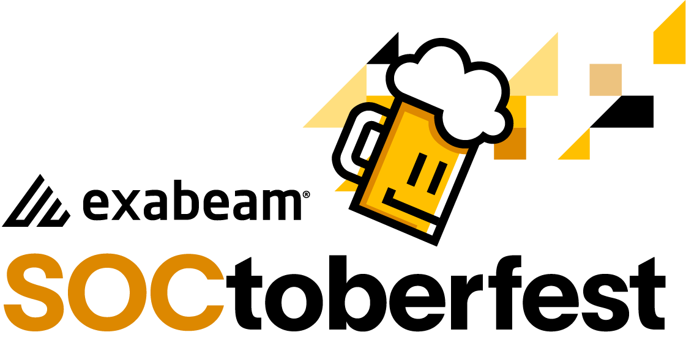

## Exabeam CTF

1. CTF event is hosted on a event URL - https://ctf-2-event.exalabs.io/

2. You will need to register an account (or your host will pre-provision for you before the event) to access the event URL to receive the challenges. [Check here for pre-provisioned accounts](./participants.csv)

3. **(If required)** [Follow this instruction to register and access the event URL](./HowTo/registration.md)

4. To solve the challenges, you will need access to the Advanced Analytics platform loaded with the game data - https://ctf-2-aa.exalabs.io/

5. The login credentials are: exabeamctf@gmail.com | c4ptur3ctf!

## Important tips:

1. You can solve most of the challenges using these main tools on Advanced Analytics platform:
	* [Notable lists/Wacthlists](./WhatIs/notable_lists&watchlists.md)
	* [User Profile page](./WhatIs/user_profile.md)
	* [User Timeline](./WhatIs/timeline.md)
	* [Data Insights](./WhatIs/data_insights.md)
	* [Threat Hunter](./WhatIs/threat_hunter.md)

2. You will need to be aware of these concepts:
	* Notable threshold is 90
	* [What are normal and abnormal events on the timeline](./WhatIs/timeline.md)
	* [What are trigggered rules and risk scores](./WhatIs/timeline.md)

## Other tips

1. [You can change the default dark mode to light mode](./HowTo/color_mode.md)
2. Join a breakout room and ask us anything. No penalty. :)
3. Have fun!

